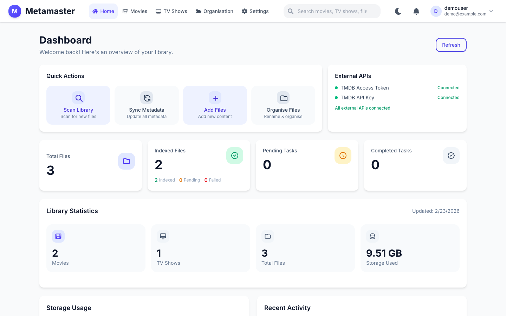

# MetaMaster

[](https://github.com/John-Limb/metamaster/actions/workflows/ci.yml)
[](https://github.com/John-Limb/metamaster/actions/workflows/docker.yml)ß
[](https://app.codacy.com?utm_source=gh&utm_medium=referral&utm_content=&utm_campaign=Badge_grade)
A comprehensive web-based media metadata management system for organizing and managing your movie and TV show library with automatic metadata enrichment from TMDB (The Movie Database).



## Features

- **Media Library Management**: Organize movies and TV shows with detailed metadata
- **Automatic File Detection**: Monitor directories for new media files
- **Metadata Enrichment**: Automatic metadata lookup from TMDB for movies and TV shows
- **File Analysis**: Extract technical details (resolution, bitrate, codec) using FFPROBE
- **Background Processing**: Celery-based task queue for long-running operations
- **REST API**: Comprehensive REST API with automatic documentation
- **Web Interface**: Modern React-based frontend with file navigation and management
- **Storage Analytics**: Comprehensive storage usage tracking and visualization
- **Pattern Recognition**: Intelligent media file pattern detection
- **Advanced Search**: Full-text search across media library

---

## Deployment


## Technology Stack

### Backend

| Category | Technology | Version | Purpose |
|----------|------------|---------|---------|
| **Framework** | FastAPI | 0.132.0 | ASGI web framework |
| **ASGI Server** | Uvicorn | 0.41.0 | Production server |
| **Database** | PostgreSQL | 15 | Primary data store |
| **ORM** | SQLAlchemy | 2.0.46 | Database abstraction |
| **Migrations** | Alembic | 1.18.4 | Schema migrations |
| **Task Queue** | Celery | 5.6.2 | Background job processing |
| **Message Broker** | Redis | 7 | Celery broker & caching |
| **HTTP Client** | HTTPX | 0.28.1 | Async HTTP requests |
| **File Monitoring** | Watchdog | 6.0.0 | Directory monitoring |
| **Media Analysis** | FFprobe | system | File metadata extraction |
| **Monitoring** | Prometheus Client | 0.17.1 | Metrics collection |

### Frontend

| Category | Technology | Version | Purpose |
|----------|------------|---------|---------|
| **Framework** | React | 19.2.0 | UI library |
| **Language** | TypeScript | 5.9 | Type safety |
| **Build Tool** | Vite | 7.3.1 | Fast bundler |
| **Styling** | Tailwind CSS | 4.1 | Utility-first CSS |
| **State Management** | Zustand | 5.0.11 | Global state |
| **Server State** | TanStack Query | 5.90.20 | API caching |
| **Routing** | React Router | 7.13.0 | Client-side routing |
| **Forms** | React Hook Form | 7.71.1 | Form handling |
| **Validation** | Zod | 4.3.6 | Schema validation |
| **Charts** | Recharts | 3.7.0 | Data visualization |
| **Icons** | Lucide React | 0.563.0 | Icon library |

### Infrastructure

| Category | Technology | Purpose |
|----------|------------|---------|
| **Containerization** | Docker | Application containers |
| **Orchestration** | Docker Compose | Multi-service deployment |
| **Registry** | GitHub Container Registry | Image storage |
| **CI/CD** | GitHub Actions | Automated pipelines |

---

### External API Keys

| API | Purpose | Get Key |
|-----|---------|---------|
| TMDB API | Movie & TV show metadata | [themoviedb.org](https://www.themoviedb.org/settings/api) |

---
## Project Structure

See [docs/ARCHITECTURE.md](docs/ARCHITECTURE.md) for the full project structure and architecture details.

---

## CI/CD Pipeline

See [docs/CICD.md](docs/CICD.md) for workflow details, required secrets, and Dependabot configuration.

---

## API Documentation

Once the application is running:

- **Swagger UI**: http://localhost:8000/docs
- **ReDoc**: http://localhost:8000/redoc

See [docs/API_REFERENCE.md](docs/API_REFERENCE.md) for the full endpoint reference.

---

## Documentation

| Document | Description |
|----------|-------------|
| [Admin Guide](docs/ADMIN.md) | Admin account, password reset |
| [Architecture](docs/ARCHITECTURE.md) | Backend/frontend architecture, data models, startup flow |
| [API Reference](docs/API_REFERENCE.md) | All REST endpoints |
| [CI/CD](docs/CICD.md) | GitHub Actions workflows, secrets, Dependabot |
| [Troubleshooting](docs/USER_TROUBLESHOOTING.md) | Common issues and fixes |

---

## Contributing Guidelines

### Code Style

#### Backend (Python)

- Follow PEP 8 conventions
- Use Black for formatting (line length: 100)
- Use isort for import sorting (Black-compatible profile)
- Add type hints for all functions
- Run mypy for type checking

```bash
# Format and lint before committing
black app/ && isort app/ && flake8 app/ && mypy app/
```

#### Frontend (TypeScript/React)

- Use ESLint 9 with flat config
- Format with Prettier
- Use TypeScript strict mode
- Follow React best practices

```bash
# Format and lint before committing
npm run lint:fix && npm run format && npm run type-check
```

### Commit Message Convention

This project follows [Conventional Commits](https://www.conventionalcommits.org/):

```
<type>(<scope>): <description>

[optional body]

[optional footer(s)]
```

**Types**: `feat`, `fix`, `docs`, `style`, `refactor`, `test`, `chore`

**Examples**:
```
feat(api): add batch movie import endpoint
fix(celery): resolve task retry logic
docs(readme): update installation instructions
```

### Pull Request Process

1. Create a feature branch from `main`
2. Make your changes with clear commit messages
3. Ensure all tests pass: `pytest` (backend) and `npm run test` (frontend)
4. Run linting: `flake8 app/ && mypy app/` (backend) and `npm run lint` (frontend)
5. Update documentation if needed
6. Submit a pull request with a clear description

### Pre-commit Hooks

Frontend uses Husky and lint-staged for pre-commit checks:
- ESLint and Prettier run on staged files automatically

---

## License

This project is licensed under the MIT License - see the [LICENSE](LICENSE) file for details.

---

## Support

For issues and questions, please open an issue on the repository.
