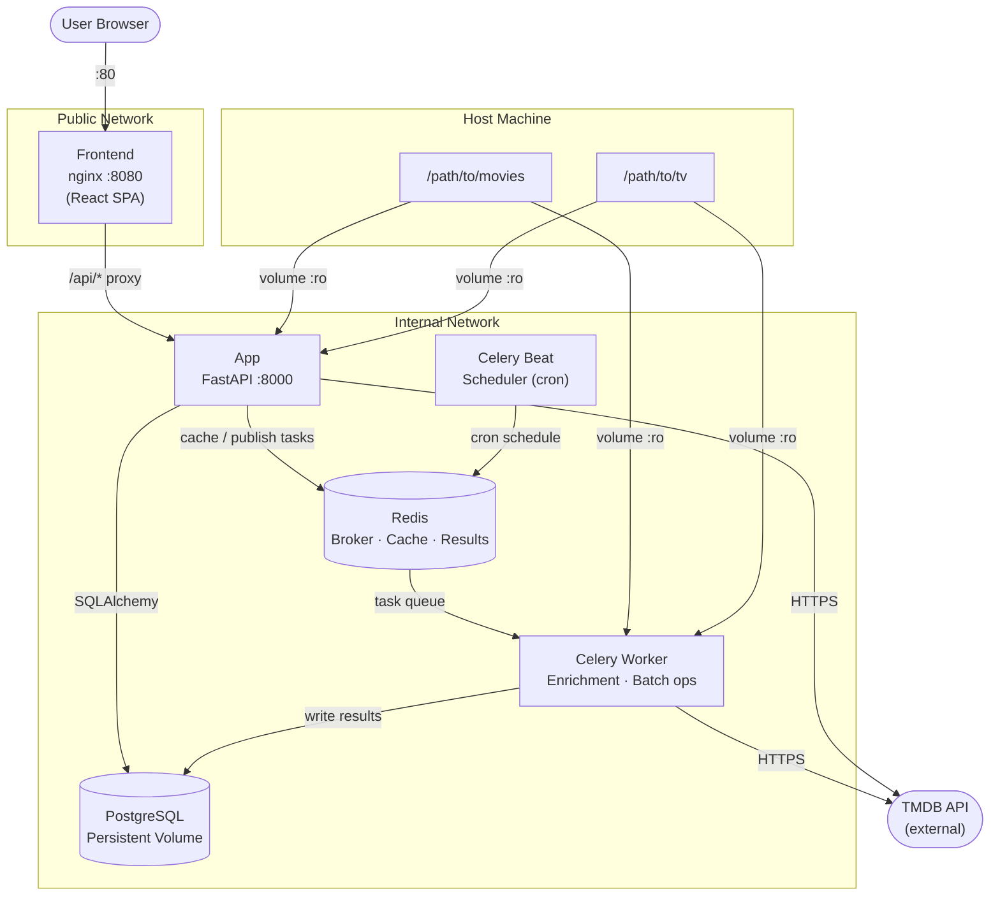

# Architecture Diagrams

## ASCII (Human Readable)

```
 USER BROWSER
      │
      │ HTTP :80
      ▼
 ┌─────────────────────────────────────────────────────────────┐
 │  PUBLIC NETWORK                                             │
 │                                                             │
 │  ┌──────────────────┐                                       │
 │  │    Frontend      │  React SPA served by nginx            │
 │  │  (nginx :8080)   │  Proxies /api/* to App internally     │
 │  └────────┬─────────┘                                       │
 └───────────┼─────────────────────────────────────────────────┘
             │ /api/* proxy
 ┌───────────┼─────────────────────────────────────────────────┐
 │  INTERNAL NETWORK                                           │
 │           │                                                  │
 │           ▼                                                  │
 │  ┌──────────────────┐   SQLAlchemy   ┌──────────────────┐   │
 │  │      App         │ ─────────────► │    PostgreSQL     │   │
 │  │   (FastAPI)      │                │   (persistent     │   │
 │  │                  │ ◄───────────── │    volume)        │   │
 │  └────────┬─────────┘                └──────────────────┘   │
 │           │                                                  │
 │           │ cache / pub                                      │
 │           ▼                                                  │
 │  ┌──────────────────┐                                        │
 │  │      Redis       │  Broker (DB 0) + Result Backend (DB 1) │
 │  │                  │  + App cache (DB 2)                    │
 │  └──────┬───────────┘                                        │
 │         │              │                                      │
 │    tasks│         beat │ schedule                            │
 │         ▼              ▼                                      │
 │  ┌──────────────┐  ┌──────────────┐                          │
 │  │Celery Worker │  │ Celery Beat  │                          │
 │  │              │  │ (Scheduler)  │                          │
 │  │ - TMDB fetch │  │ - Media scan │                          │
 │  │ - Enrichment │  │   (cron)     │                          │
 │  │ - Batch ops  │  └──────────────┘                          │
 │  └──────┬───────┘                                            │
 │         │                                                    │
 │         │ writes results                                     │
 │         ▼                                                    │
 │  ┌──────────────────┐                                        │
 │  │    PostgreSQL    │  (same DB as App)                      │
 │  └──────────────────┘                                        │
 │                                                              │
 │  Host volumes (read-only)                                    │
 │  /path/to/movies ──► /media/movies  (App + Worker)          │
 │  /path/to/tv     ──► /media/tv      (App + Worker)          │
 │                                                              │
 └──────────────────────────────────────────────────────────────┘
             │
             │ HTTPS (enrichment)
             ▼
    ┌─────────────────┐
    │    TMDB API     │
    │   (external)    │
    └─────────────────┘
```

### Data Flow

```
  New media file appears on disk
          │
          ▼
  App startup scan  ──OR──  Celery Beat (cron)
          │
          ▼
  FileService scans /media/movies + /media/tv
          │
          ▼
  Movie / TVShow record created  (status: local_only)
          │
          ▼
  Enrichment task dispatched → Redis queue
          │
          ▼
  Celery Worker picks up task
          │
          ├──► TMDB API (fetch metadata)
          │
          ▼
  Movie / TVShow record updated  (status: fully_enriched)
          │
          ▼
  Frontend reflects updated metadata
```

---

## Mermaid


