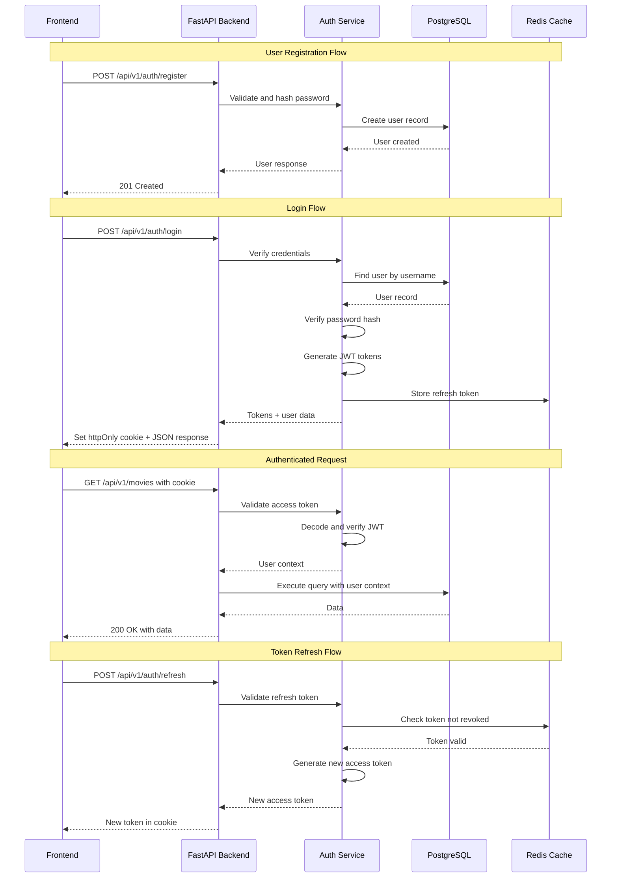
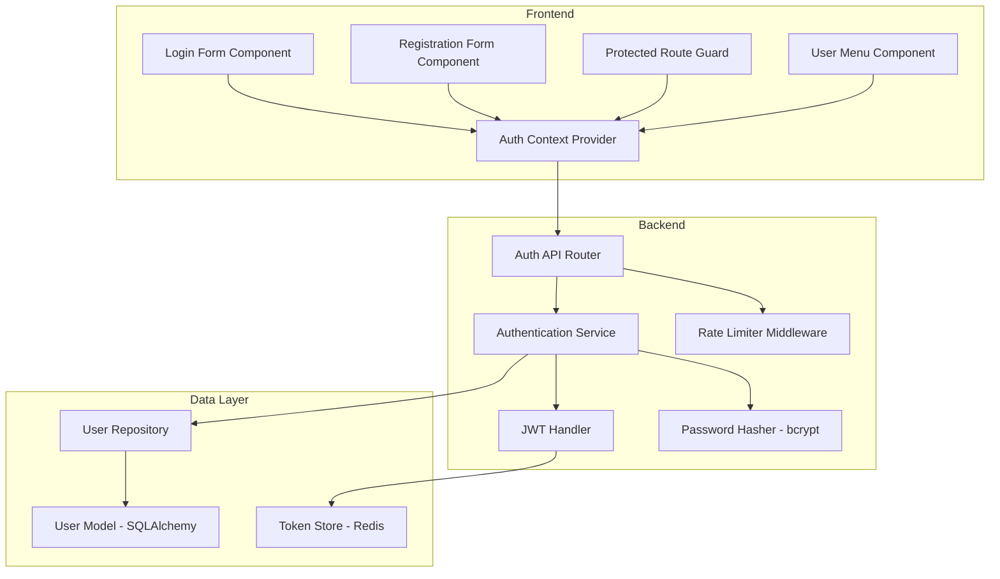
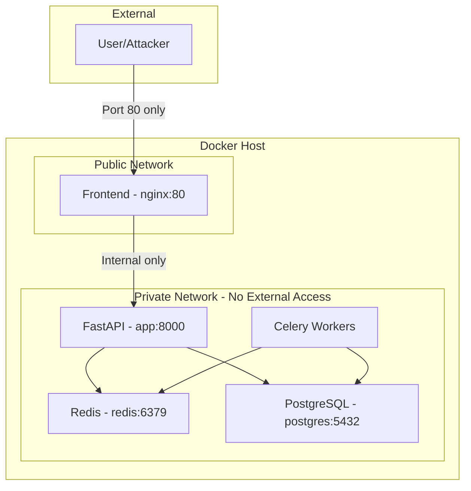

# Authentication System Architecture Design

## Overview

This document outlines the comprehensive authentication system design for the Metamaster application, addressing the current issue where the Header component has `user = null` causing TypeScript errors, and establishing a complete username/password authentication flow.

---

## 1. Architecture Overview

### 1.1 High-Level Authentication Flow



### 1.2 System Components



---

## 2. API Endpoint Specifications

### 2.1 Authentication Endpoints

All auth endpoints will be under `/api/v1/auth` with the router prefix.

#### POST `/api/v1/auth/register`

Register a new user account.

**Request Body:**
```json
{
  "username": "string (3-50 chars, alphanumeric + underscore)",
  "email": "string (valid email format)",
  "password": "string (8-128 chars, meets strength requirements)"
}
```

**Response 201:**
```json
{
  "id": 1,
  "username": "johndoe",
  "email": "john@example.com",
  "created_at": "2026-02-12T19:00:00Z"
}
```

**Error Responses:**
- `400` - Validation error (weak password, invalid email)
- `409` - Username or email already exists

---

#### POST `/api/v1/auth/login`

Authenticate user and receive tokens.

**Request Body:**
```json
{
  "username": "string",
  "password": "string"
}
```

**Response 200:**
```json
{
  "access_token": "eyJhbGciOiJIUzI1NiIs...",
  "token_type": "bearer",
  "expires_in": 900,
  "user": {
    "id": 1,
    "username": "johndoe",
    "email": "john@example.com",
    "avatar": null
  }
}
```

**Cookies Set:**
- `refresh_token`: httpOnly, secure, sameSite=strict

**Error Responses:**
- `401` - Invalid credentials
- `429` - Too many attempts (rate limited)

---

#### POST `/api/v1/auth/refresh`

Refresh access token using refresh token.

**Cookies Required:**
- `refresh_token`: httpOnly cookie

**Response 200:**
```json
{
  "access_token": "eyJhbGciOiJIUzI1NiIs...",
  "token_type": "bearer",
  "expires_in": 900
}
```

**Error Responses:**
- `401` - Invalid or expired refresh token

---

#### POST `/api/v1/auth/logout`

Logout user and invalidate tokens.

**Cookies Required:**
- `refresh_token`: httpOnly cookie

**Response 200:**
```json
{
  "message": "Successfully logged out"
}
```

---

#### GET `/api/v1/auth/me`

Get current authenticated user.

**Headers:**
- `Authorization: Bearer <access_token>`

**Response 200:**
```json
{
  "id": 1,
  "username": "johndoe",
  "email": "john@example.com",
  "avatar": null,
  "created_at": "2026-02-12T19:00:00Z"
}
```

**Error Responses:**
- `401` - Not authenticated

---

### 2.2 Rate Limiting Configuration

| Endpoint | Rate Limit | Window |
|----------|------------|--------|
| `/auth/login` | 5 requests | 1 minute |
| `/auth/register` | 3 requests | 1 hour |
| `/auth/refresh` | 20 requests | 1 minute |

---

## 3. Database Schema for User Model

### 3.1 User Table Definition

Following the existing pattern in [`app/domain/common/models.py`](app/domain/common/models.py):

```python
# app/domain/auth/models.py

from datetime import datetime
from sqlalchemy import Column, Integer, String, Boolean, DateTime, Index
from app.core.database import Base


class User(Base):
    """User account for authentication"""

    __tablename__ = "users"

    id = Column(Integer, primary_key=True, index=True)
    username = Column(String(50), unique=True, nullable=False, index=True)
    email = Column(String(255), unique=True, nullable=False, index=True)
    password_hash = Column(String(255), nullable=False)
    is_active = Column(Boolean, default=True, nullable=False)
    is_verified = Column(Boolean, default=False, nullable=False)
    avatar_url = Column(String(500), nullable=True)
    last_login = Column(DateTime, nullable=True)
    created_at = Column(DateTime, default=datetime.utcnow, nullable=False)
    updated_at = Column(DateTime, default=datetime.utcnow, onupdate=datetime.utcnow, nullable=False)

    __table_args__ = (
        Index("idx_users_username", "username"),
        Index("idx_users_email", "email"),
        Index("idx_users_active", "is_active"),
    )
```

### 3.2 Initial Admin User Setup

On first application startup, a default admin user is automatically created with a randomly generated password.

```python
# app/core/init_db.py

import secrets
import string
from app.domain.auth.models import User
from app.domain.auth.service import hash_password

def generate_random_password(length=16):
    """Generate a secure random password"""
    alphabet = string.ascii_letters + string.digits + "!@#$%^&*"
    return ''.join(secrets.choice(alphabet) for _ in range(length))

def create_admin_user(db: Session) -> str | None:
    """Create default admin user if no users exist"""
    existing_users = db.query(User).count()
    if existing_users > 0:
        return None  # Users already exist, skip
    
    password = generate_random_password()
    admin_user = User(
        username="admin",
        email="admin@localhost",
        password_hash=hash_password(password),
        is_active=True,
        is_verified=True,
        requires_password_change=True,  # Flag for forced password change
    )
    db.add(admin_user)
    db.commit()
    
    # Log the credentials (visible in docker logs)
    logger.info("=" * 60)
    logger.info("DEFAULT ADMIN USER CREATED")
    logger.info(f"Username: admin")
    logger.info(f"Password: {password}")
    logger.info("Please change this password on first login!")
    logger.info("=" * 60)
    
    return password
```

**User Model Addition:**

```python
# Add to User model in app/domain/auth/models.py

class User(Base):
    # ... existing fields ...
    requires_password_change = Column(Boolean, default=False, nullable=False)
```

**API Response for Password Change Required:**

```python
# app/api/v1/auth/endpoints.py

@router.post("/login")
async def login(credentials: LoginRequest, response: Response):
    user = authenticate_user(credentials)
    
    if user.requires_password_change:
        # Return special response indicating password change required
        return {
            "access_token": create_access_token(user),
            "token_type": "bearer",
            "requires_password_change": True,
            "user": user_to_dict(user)
        }
    
    # Normal login flow...
```

**Password Change Endpoint:**

```python
@router.post("/change-password")
async def change_password(
    request: ChangePasswordRequest,
    current_user: User = Depends(get_current_user),
    db: Session = Depends(get_db)
):
    """Change user password - required for first-time admin login"""
    verify_current_password(current_user, request.current_password)
    validate_password_strength(request.new_password)
    
    current_user.password_hash = hash_password(request.new_password)
    current_user.requires_password_change = False
    db.commit()
    
    return {"message": "Password changed successfully"}
```

**Frontend Handling:**

```typescript
// In AuthContext.tsx
if (response.requires_password_change) {
  // Redirect to password change screen
  navigate('/change-password', { 
    state: { message: 'You must change your password before continuing' }
  });
}
```

### 3.3 Refresh Token Table (for token blacklisting)

```python
# app/domain/auth/models.py (continued)

class RefreshToken(Base):
    """Refresh token storage for invalidation support"""

    __tablename__ = "refresh_tokens"

    id = Column(Integer, primary_key=True, index=True)
    token_hash = Column(String(255), unique=True, nullable=False, index=True)
    user_id = Column(Integer, ForeignKey("users.id"), nullable=False)
    expires_at = Column(DateTime, nullable=False)
    revoked = Column(Boolean, default=False, nullable=False)
    created_at = Column(DateTime, default=datetime.utcnow, nullable=False)

    __table_args__ = (
        Index("idx_refresh_tokens_hash", "token_hash"),
        Index("idx_refresh_tokens_user", "user_id"),
        Index("idx_refresh_tokens_expires", "expires_at"),
    )
```

### 3.3 Alembic Migration

Create migration file: `alembic/versions/004_add_auth_models.py`

```python
"""Add auth models

Revision ID: 004
Revises: 003_add_batch_operations
Create Date: 2026-02-12

"""
from alembic import op
import sqlalchemy as sa

# revision identifiers
revision = '004'
down_revision = '003_add_batch_operations'
branch_labels = None
depends_on = None


def upgrade():
    # Create users table
    op.create_table(
        'users',
        sa.Column('id', sa.Integer(), nullable=False),
        sa.Column('username', sa.String(50), nullable=False),
        sa.Column('email', sa.String(255), nullable=False),
        sa.Column('password_hash', sa.String(255), nullable=False),
        sa.Column('is_active', sa.Boolean(), nullable=False, server_default='true'),
        sa.Column('is_verified', sa.Boolean(), nullable=False, server_default='false'),
        sa.Column('avatar_url', sa.String(500), nullable=True),
        sa.Column('last_login', sa.DateTime(), nullable=True),
        sa.Column('created_at', sa.DateTime(), nullable=False, server_default=sa.func.utcnow()),
        sa.Column('updated_at', sa.DateTime(), nullable=False, server_default=sa.func.utcnow()),
        sa.PrimaryKeyConstraint('id'),
    )
    op.create_index('idx_users_username', 'users', ['username'], unique=True)
    op.create_index('idx_users_email', 'users', ['email'], unique=True)
    op.create_index('idx_users_active', 'users', ['is_active'])

    # Create refresh_tokens table
    op.create_table(
        'refresh_tokens',
        sa.Column('id', sa.Integer(), nullable=False),
        sa.Column('token_hash', sa.String(255), nullable=False),
        sa.Column('user_id', sa.Integer(), nullable=False),
        sa.Column('expires_at', sa.DateTime(), nullable=False),
        sa.Column('revoked', sa.Boolean(), nullable=False, server_default='false'),
        sa.Column('created_at', sa.DateTime(), nullable=False, server_default=sa.func.utcnow()),
        sa.ForeignKeyConstraint(['user_id'], ['users.id'], ondelete='CASCADE'),
        sa.PrimaryKeyConstraint('id'),
    )
    op.create_index('idx_refresh_tokens_hash', 'refresh_tokens', ['token_hash'], unique=True)
    op.create_index('idx_refresh_tokens_user', 'refresh_tokens', ['user_id'])
    op.create_index('idx_refresh_tokens_expires', 'refresh_tokens', ['expires_at'])


def downgrade():
    op.drop_table('refresh_tokens')
    op.drop_table('users')
```

---

## 4. Frontend Component Structure

### 4.1 Auth Context Provider

Following the existing pattern in [`frontend/src/context/ThemeContext.tsx`](frontend/src/context/ThemeContext.tsx):

```typescript
// frontend/src/context/AuthContext.tsx

import { createContext, useContext, useState, useEffect, useCallback, type ReactNode } from 'react';

interface User {
  id: number;
  username: string;
  email: string;
  avatar: string | null;
}

interface AuthContextType {
  user: User | null;
  isAuthenticated: boolean;
  isLoading: boolean;
  login: (username: string, password: string) => Promise<void>;
  register: (username: string, email: string, password: string) => Promise<void>;
  logout: () => Promise<void>;
  refreshUser: () => Promise<void>;
}

const AuthContext = createContext<AuthContextType | undefined>(undefined);

export function AuthProvider({ children }: { children: ReactNode }) {
  // Implementation details in checklist
}

export function useAuth(): AuthContextType {
  const context = useContext(AuthContext);
  if (context === undefined) {
    throw new Error('useAuth must be used within an AuthProvider');
  }
  return context;
}
```

### 4.2 Component Directory Structure

```
frontend/src/
├── context/
│   └── AuthContext.tsx          # Auth state management
├── components/
│   └── auth/
│       ├── LoginForm.tsx        # Login form component
│       ├── RegisterForm.tsx     # Registration form component
│       ├── ProtectedRoute.tsx   # Route guard component
│       └── index.ts             # Barrel export
├── hooks/
│   └── useAuth.ts               # Re-export of useAuth hook
├── services/
│   └── authService.ts           # API calls for auth
└── types/
    └── auth.ts                  # Auth-related TypeScript types
```

### 4.3 LoginForm Component

```typescript
// frontend/src/components/auth/LoginForm.tsx

interface LoginFormProps {
  onSuccess?: () => void;
  onSwitchToRegister?: () => void;
}

export function LoginForm({ onSuccess, onSwitchToRegister }: LoginFormProps) {
  // Form state, validation, submission logic
  // Uses useAuth() hook for login action
}
```

### 4.4 ProtectedRoute Component

```typescript
// frontend/src/components/auth/ProtectedRoute.tsx

import { Navigate, useLocation } from 'react-router-dom';
import { useAuth } from '@/context/AuthContext';
import { LoadingSpinner } from '@/components/common';

interface ProtectedRouteProps {
  children: React.ReactNode;
}

export function ProtectedRoute({ children }: ProtectedRouteProps) {
  const { isAuthenticated, isLoading } = useAuth();
  const location = useLocation();

  if (isLoading) {
    return <LoadingSpinner />;
  }

  if (!isAuthenticated) {
    return <Navigate to="/login" state={{ from: location }} replace />;
  }

  return <>{children}</>;
}
```

### 4.5 Updated Header Component

The [`frontend/src/components/layout/Header/Header.tsx`](frontend/src/components/layout/Header/Header.tsx:40) needs to be updated:

```typescript
// In Header.tsx, replace line 40:
// const user = null

// With:
import { useAuth } from '@/context/AuthContext';

export const Header: React.FC<HeaderProps> = ({ onMenuClick }) => {
  const { user, logout } = useAuth();
  // ... rest of component
  
  const handleLogout = async () => {
    await logout();
  };
  
  // UserMenu now receives actual user data or renders login button
};
```

### 4.6 Updated UserMenu Component

The [`frontend/src/components/layout/UserMenu/UserMenu.tsx`](frontend/src/components/layout/UserMenu/UserMenu.tsx:4) needs to handle null user:

```typescript
interface UserMenuProps {
  user: { name: string; email: string; avatar?: string } | null;
  onProfile: () => void;
  onSettings: () => void;
  onLogout: () => void;
  onLogin?: () => void;  // New: for unauthenticated state
}

export const UserMenu: React.FC<UserMenuProps> = ({
  user,
  onProfile,
  onSettings,
  onLogout,
  onLogin,
}) => {
  if (!user) {
    return (
      <button onClick={onLogin} className="...">
        Sign In
      </button>
    );
  }
  // ... existing authenticated UI
};
```

---

## 5. Security Implementation Details

### 5.1 Container Network Security

**Problem:** In the current Docker setup, the backend API (port 8000), PostgreSQL (port 5432), and Redis (port 6379) are all exposed to the host, making them directly accessible from outside the Docker network.

**Solution:** Implement network segmentation with only the frontend exposed externally.



**Recommended Docker Network Configuration:**

We use a separate `docker-compose.dev.yml` for development that overrides the production security settings:

```yaml
# docker-compose.yml - Production (secured)

services:
  frontend:
    ports:
      - "80:80"
    networks:
      - public
      - internal

  app:
    ports: []  # No external access
    networks:
      - internal

  postgres:
    ports: []  # No external access
    networks:
      - internal

  redis:
    ports: []  # No external access
    networks:
      - internal

networks:
  public:
    driver: bridge
  internal:
    driver: bridge
    internal: true  # Blocks external routing
```

```yaml
# docker-compose.dev.yml - Development overrides

services:
  app:
    ports:
      - "8000:8000"  # Direct API access for debugging

  postgres:
    ports:
      - "5432:5432"  # Direct DB access for debugging

  redis:
    ports:
      - "6379:6379"  # Direct Redis access for debugging
```

**Usage:**
```bash
# Production deployment
docker-compose up -d

# Development with debug ports
docker-compose -f docker-compose.yml -f docker-compose.dev.yml up -d
```

**Additional Security Measures:**

1. **API Gateway Pattern (nginx reverse proxy):**
   ```nginx
   # frontend/nginx.conf
   location /api/ {
       proxy_pass http://app:8000/api/;
       proxy_set_header Host $host;
       proxy_set_header X-Real-IP $remote_addr;
       proxy_set_header X-Forwarded-For $proxy_add_x_forwarded_for;
       proxy_set_header X-Forwarded-Proto $scheme;
   }
   ```

2. **Internal API Key for Service-to-Service Communication:**
   ```python
   # app/api/middleware/service_auth.py
   INTERNAL_API_KEY = settings.internal_api_key
   
   async def verify_internal_request(request: Request):
       if request.url.path.startswith("/internal/"):
           api_key = request.headers.get("X-Internal-API-Key")
           if api_key != INTERNAL_API_KEY:
               raise HTTPException(status_code=403)
   ```

3. **Rate Limiting at nginx Level:**
   ```nginx
   limit_req_zone $binary_remote_addr zone=auth_limit:10m rate=5r/m;
   
   location /api/v1/auth/login {
       limit_req zone=auth_limit burst=10 nodelay;
       proxy_pass http://app:8000;
   }
   ```

### 5.2 Password Security

**Hashing Algorithm:** Argon2id (winner of Password Hashing Competition 2015)

Argon2id is the recommended choice as it combines the resistance to side-channel attacks from Argon2i with the resistance to GPU cracking attacks from Argon2d.

```python
# app/domain/auth/service.py

from argon2 import PasswordHasher
from argon2.exceptions import VerifyMismatchError

# Argon2id with recommended OWASP parameters
ph = PasswordHasher(
    time_cost=3,        # Number of iterations (default: 2)
    memory_cost=65536,  # Memory usage in KiB (64 MB)
    parallelism=4,      # Number of parallel threads
    hash_len=32,        # Hash length in bytes
    salt_len=16,        # Salt length in bytes
)

def hash_password(password: str) -> str:
    return ph.hash(password)

def verify_password(plain_password: str, hashed_password: str) -> bool:
    try:
        ph.verify(hashed_password, plain_password)
        return True
    except VerifyMismatchError:
        return False
```

**Argon2id Parameters Explained:**
- **time_cost=3**: 3 iterations through the memory block
- **memory_cost=65536**: 64 MB of memory per hash (resists GPU attacks)
- **parallelism=4**: Uses 4 threads (adjust based on server CPU)
- **hash_len=32**: 256-bit hash output
- **salt_len=16**: 128-bit salt (unique per password)

**Password Requirements:**
- Minimum 8 characters
- Maximum 128 characters
- At least one uppercase letter
- At least one lowercase letter
- At least one digit
- At least one special character

```python
# app/domain/auth/validators.py

import re

PASSWORD_PATTERN = re.compile(
    r'^(?=.*[a-z])(?=.*[A-Z])(?=.*\d)(?=.*[@$!%*?&])[A-Za-z\d@$!%*?&]{8,128}$'
)

def validate_password_strength(password: str) -> tuple[bool, str]:
    if not PASSWORD_PATTERN.match(password):
        return False, "Password must be 8-128 chars with uppercase, lowercase, digit, and special char"
    return True, ""
```

### 5.2 JWT Configuration

**Token Types:**
- Access Token: Short-lived (15 minutes), contains user claims
- Refresh Token: Long-lived (7 days), stored in httpOnly cookie

```python
# app/core/config.py additions

class Settings(BaseSettings):
    # ... existing settings ...
    
    # JWT Settings
    jwt_secret_key: str = "CHANGE_ME_IN_PRODUCTION"  # Must be set via env
    jwt_algorithm: str = "HS256"
    access_token_expire_minutes: int = 15
    refresh_token_expire_days: int = 7
```

**JWT Payload Structure:**

```json
{
  "sub": "user_id:1",
  "username": "johndoe",
  "exp": 1707765000,
  "iat": 1707764100,
  "type": "access"
}
```

### 5.3 Token Storage Strategy

**Recommended: httpOnly Cookies for Refresh Tokens**

| Token Type | Storage | Reasoning |
|------------|---------|-----------|
| Access Token | Memory (React state) | Short-lived, accessible to JS for API calls |
| Refresh Token | httpOnly cookie | Protected from XSS, automatic sending |

**Cookie Configuration:**

```python
# app/api/v1/auth/endpoints.py

from fastapi import Response

def set_refresh_token_cookie(response: Response, token: str):
    response.set_cookie(
        key="refresh_token",
        value=token,
        httponly=True,
        secure=True,  # HTTPS only in production
        samesite="strict",
        max_age=7 * 24 * 60 * 60,  # 7 days
        path="/api/v1/auth/refresh"  # Only sent to refresh endpoint
    )
```

### 5.4 CSRF Protection

Since we're using httpOnly cookies with sameSite=strict, CSRF is largely mitigated. For additional protection:

1. **SameSite Cookie Attribute:** Set to `strict` for refresh token cookie
2. **Origin Validation:** Validate Origin header on auth endpoints
3. **State Parameter:** For any OAuth flows (future)

```python
# app/api/middleware/csrf.py

from fastapi import Request, HTTPException

def validate_origin(request: Request, allowed_origins: list[str]):
    origin = request.headers.get("origin")
    if origin and origin not in allowed_origins:
        raise HTTPException(status_code=403, detail="Invalid origin")
```

### 5.5 Rate Limiting Implementation

Using Redis for distributed rate limiting:

```python
# app/infrastructure/security/rate_limiter.py

import redis
from fastapi import HTTPException

class RateLimiter:
    def __init__(self, redis_client: redis.Redis):
        self.redis = redis_client
    
    async def check_rate_limit(
        self, 
        key: str, 
        max_requests: int, 
        window_seconds: int
    ) -> bool:
        current = await self.redis.get(key)
        if current and int(current) >= max_requests:
            raise HTTPException(
                status_code=429, 
                detail="Too many requests"
            )
        
        pipe = self.redis.pipeline()
        pipe.incr(key)
        pipe.expire(key, window_seconds)
        await pipe.execute()
        return True
```

---

## 6. Implementation Checklist

### Phase 1: Backend Foundation

- [ ] **Secure Docker network configuration**
  - [ ] Create separate `public` and `internal` Docker networks
  - [ ] Create `docker-compose.dev.yml` override for development ports
  - [ ] Remove port exposures from production compose (only frontend:80)
  - [ ] Configure nginx reverse proxy for API routing
  - [ ] Add internal API key for service-to-service auth
  - [ ] Test that backend is not directly accessible in production mode

- [ ] **Create auth domain module**
  - [ ] Create `app/domain/auth/__init__.py`
  - [ ] Create `app/domain/auth/models.py` with User and RefreshToken models
  - [ ] Add `requires_password_change` field to User model
  - [ ] Create `app/domain/auth/schemas.py` with Pydantic schemas
  - [ ] Create `app/domain/auth/service.py` with auth business logic
  - [ ] Create `app/domain/auth/validators.py` with password validation

- [ ] **Implement initial admin user setup**
  - [ ] Add `create_admin_user()` function to `app/core/init_db.py`
  - [ ] Generate secure random password (16 chars with special chars)
  - [ ] Log admin credentials to Docker logs on first startup
  - [ ] Set `requires_password_change=True` for admin user
  - [ ] Add `/api/v1/auth/change-password` endpoint

- [ ] **Create Alembic migration**
  - [ ] Create `alembic/versions/004_add_auth_models.py`
  - [ ] Test migration up and down

- [ ] **Add JWT configuration**
  - [ ] Add JWT settings to `app/core/config.py`
  - [ ] Add `jwt_secret_key` to `.env.example`

- [ ] **Create auth API endpoints**
  - [ ] Create `app/api/v1/auth/__init__.py`
  - [ ] Create `app/api/v1/auth/endpoints.py` with all auth routes
  - [ ] Register auth router in `app/main.py`

- [ ] **Implement security features**
  - [ ] Create `app/infrastructure/security/rate_limiter.py`
  - [ ] Create `app/infrastructure/security/password.py` with Argon2id hashing
  - [ ] Create `app/infrastructure/security/jwt.py`

### Phase 2: Frontend Foundation

- [ ] **Create auth types**
  - [ ] Create `frontend/src/types/auth.ts` with User, LoginCredentials, etc.

- [ ] **Create auth service**
  - [ ] Create `frontend/src/services/authService.ts` with API calls

- [ ] **Create auth context**
  - [ ] Create `frontend/src/context/AuthContext.tsx`
  - [ ] Implement login, logout, register, refresh functions
  - [ ] Add auto-refresh token logic

- [ ] **Create auth components**
  - [ ] Create `frontend/src/components/auth/LoginForm.tsx`
  - [ ] Create `frontend/src/components/auth/RegisterForm.tsx`
  - [ ] Create `frontend/src/components/auth/ChangePasswordForm.tsx`
  - [ ] Create `frontend/src/components/auth/ProtectedRoute.tsx`
  - [ ] Create `frontend/src/components/auth/index.ts`

- [ ] **Update existing components**
  - [ ] Update `frontend/src/components/layout/Header/Header.tsx` to use auth context
  - [ ] Update `frontend/src/components/layout/UserMenu/UserMenu.tsx` to handle null user
  - [ ] Add AuthProvider to `frontend/src/main.tsx`

- [ ] **Create auth pages**
  - [ ] Create `frontend/src/pages/LoginPage.tsx`
  - [ ] Create `frontend/src/pages/RegisterPage.tsx`
  - [ ] Create `frontend/src/pages/ChangePasswordPage.tsx`
  - [ ] Add routes to `frontend/src/App.tsx`

### Phase 3: Integration & Testing

- [ ] **Integration testing**
  - [ ] Test registration flow end-to-end
  - [ ] Test login flow end-to-end
  - [ ] Test token refresh flow
  - [ ] Test logout flow
  - [ ] Test protected routes

- [ ] **Security testing**
  - [ ] Test rate limiting
  - [ ] Test password validation
  - [ ] Test token expiration handling
  - [ ] Test CSRF protection

- [ ] **Documentation**
  - [ ] Update API documentation
  - [ ] Update README with auth setup instructions

---

## 7. Dependencies

### Backend (Python)

Add to `requirements.txt`:

```
# Authentication
argon2-cffi>=23.1.0
PyJWT>=2.8.0
python-multipart>=0.0.6  # For form data parsing
```

### Frontend (TypeScript)

No additional dependencies required - using native fetch API and existing React patterns.

---

## 8. Environment Variables

Add to `.env.example`:

```env
# JWT Configuration
JWT_SECRET_KEY=your-super-secret-key-change-in-production
JWT_ALGORITHM=HS256
ACCESS_TOKEN_EXPIRE_MINUTES=15
REFRESH_TOKEN_EXPIRE_DAYS=7
```

---

## 9. Future Enhancements

The following features are out of scope for the initial implementation but should be considered for future iterations:

1. **Email Verification** - Require email confirmation before account activation
2. **Password Reset** - Forgot password flow with email tokens
3. **OAuth Integration** - Google, GitHub, etc. authentication
4. **Two-Factor Authentication** - TOTP-based 2FA
5. **Session Management** - View and revoke active sessions
6. **Audit Logging** - Track authentication events for security

---

## 10. References

- [FastAPI Security Documentation](https://fastapi.tiangolo.com/tutorial/security/)
- [OWASP Authentication Cheat Sheet](https://cheatsheetseries.owasp.org/cheatsheets/Authentication_Cheat_Sheet.html)
- [OWASP Password Storage Cheat Sheet](https://cheatsheetseries.owasp.org/cheatsheets/Password_Storage_Cheat_Sheet.html)
- [Argon2 RFC 9106](https://www.rfc-editor.org/rfc/rfc9106)
- [JWT.io](https://jwt.io/) - JWT debugging tool
- [argon2-cffi Documentation](https://argon2-cffi.readthedocs.io/)
