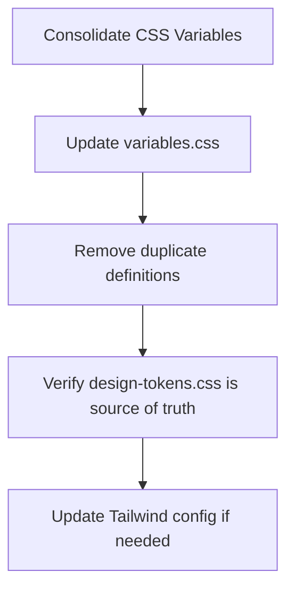
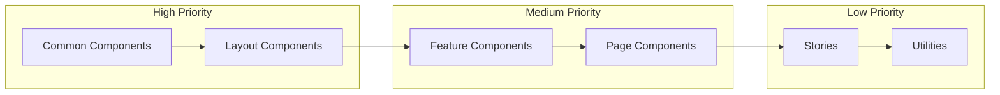

# Color Migration Plan

## Executive Summary

This document provides a comprehensive audit of hardcoded colors in the Metamaster frontend codebase and a detailed migration strategy to align with the design system defined in [`01_DESIGN_SYSTEM.md`](./01_DESIGN_SYSTEM.md).

### Key Findings

| Metric | Count |
|--------|-------|
| CSS files with hardcoded colors | 12 |
| Total hex color instances | 134 |
| Total rgba() instances | 18 |
| Named color instances | 4 |
| TSX files with hardcoded colors | 2 |
| **Total color references to migrate** | **158** |

### Critical Issue: Duplicate CSS Variable Systems

The codebase contains **two conflicting CSS variable systems**:

1. **[`frontend/src/styles/variables.css`](../../frontend/src/styles/variables.css)** - Uses **Sky/Cyan** (#0ea5e9) as primary colors
2. **[`frontend/src/styles/design-tokens.css`](../../frontend/src/styles/design-tokens.css)** - Uses **Indigo** (#6366f1) as primary colors (CORRECT)

The `variables.css` file defines incorrect primary colors that do not match the design system.

---

## Design System Reference

### Primary Colors (Indigo)

| Shade | Hex | CSS Variable | Tailwind Class |
|-------|-----|--------------|----------------|
| 50 | #f0f4ff | `--color-primary-50` | `primary-50` |
| 100 | #e0e7ff | `--color-primary-100` | `primary-100` |
| 200 | #c7d2fe | `--color-primary-200` | `primary-200` |
| 300 | #a5b4fc | `--color-primary-300` | `primary-300` |
| 400 | #818cf8 | `--color-primary-400` | `primary-400` |
| 500 | #6366f1 | `--color-primary-500` | `primary-500` |
| 600 | #4f46e5 | `--color-primary-600` | `primary-600` |
| 700 | #4338ca | `--color-primary-700` | `primary-700` |
| 800 | #3730a3 | `--color-primary-800` | `primary-800` |
| 900 | #312e81 | `--color-primary-900` | `primary-900` |

### Accent Colors

| Color | Hex | CSS Variable | Tailwind Class |
|-------|-----|--------------|----------------|
| Success | #10b981 | `--color-success` | `success` |
| Warning | #f59e0b | `--color-warning` | `warning` |
| Danger | #ef4444 | `--color-danger` | `danger` |
| Info | #3b82f6 | `--color-info` | `info` |

### Neutral Colors

| Shade | Light Mode | Dark Mode | Usage |
|-------|------------|-----------|-------|
| Background | #f8fafc | #0f172a | Page backgrounds |
| Surface | #ffffff | #1e293b | Cards, panels |
| Text | #0f172a | #f8fafc | Primary text |
| Text Muted | #64748b | #94a3b8 | Secondary text |
| Border | #e2e8f0 | #334155 | Borders, dividers |

---

## Complete Color Inventory

### 1. CSS Variable Files

#### [`frontend/src/styles/variables.css`](../../frontend/src/styles/variables.css) ⚠️ CRITICAL

**Status**: Contains INCORRECT primary colors (Sky/Cyan instead of Indigo)

| Line | Current Color | Design System | Migration Action |
|------|---------------|---------------|------------------|
| 5 | #f0f9ff (sky-50) | #f0f4ff (indigo-50) | Replace with indigo |
| 6 | #e0f2fe (sky-100) | #e0e7ff (indigo-100) | Replace with indigo |
| 7 | #bae6fd (sky-200) | #c7d2fe (indigo-200) | Replace with indigo |
| 8 | #7dd3fc (sky-300) | #a5b4fc (indigo-300) | Replace with indigo |
| 9 | #38bdf8 (sky-400) | #818cf8 (indigo-400) | Replace with indigo |
| 10 | #0ea5e9 (sky-500) | #6366f1 (indigo-500) | Replace with indigo |
| 11 | #0284c7 (sky-600) | #4f46e5 (indigo-600) | Replace with indigo |
| 12 | #0369a1 (sky-700) | #4338ca (indigo-700) | Replace with indigo |
| 13 | #075985 (sky-800) | #3730a3 (indigo-800) | Replace with indigo |
| 14 | #0c3d66 (sky-900) | #312e81 (indigo-900) | Replace with indigo |

**Recommendation**: Either delete this file entirely and use `design-tokens.css`, or update all primary colors to match the indigo palette.

#### [`frontend/src/styles/design-tokens.css`](../../frontend/src/styles/design-tokens.css) ✅ CORRECT

**Status**: Already aligned with design system. No changes needed.

---

### 2. Component CSS Files

#### [`frontend/src/index.css`](../../frontend/src/index.css)

| Line | Current | Context | Migration |
|------|---------|---------|-----------|
| 240 | #0000ff | Primary 500 placeholder | Use `var(--color-primary-500)` |
| 241 | #0000dd | Primary 600 placeholder | Use `var(--color-primary-600)` |
| 242 | #000000 | Text color | Use `var(--color-text)` |
| 243 | #ffffff | Background color | Use `var(--color-surface)` |
| 244 | #000000 | Border color | Use `var(--color-border)` |
| 248 | #ffff00 | Dark mode primary 500 | Use `var(--color-primary-500)` |
| 249 | #ffdd00 | Dark mode primary 600 | Use `var(--color-primary-600)` |
| 250 | #ffffff | Dark mode text | Use `var(--color-text)` |
| 251 | #000000 | Dark mode background | Use `var(--color-background)` |
| 252 | #ffffff | Dark mode border | Use `var(--color-border)` |
| 266 | white | Body background | Use `var(--color-surface)` |
| 267 | black | Body text | Use `var(--color-text)` |

#### [`frontend/src/App.css`](../../frontend/src/App.css)

| Line | Current | Context | Migration |
|------|---------|---------|-----------|
| 15 | #646cffaa | Logo hover shadow | Use `var(--color-primary-500)` with opacity |
| 18 | #61dafbaa | React logo hover | Keep as-is (brand color) or use primary |
| 41 | #888 | Read the docs text | Use `var(--color-text-muted)` |

#### [`frontend/src/styles/globals.css`](../../frontend/src/styles/globals.css)

| Line | Current | Context | Migration |
|------|---------|---------|-----------|
| 5 | #111827 | Body text | Use `var(--color-text)` |
| 42 | #0284c7 | Link color | Use `var(--color-primary-600)` |
| 47 | #0369a1 | Link hover | Use `var(--color-primary-700)` |
| 71 | #0ea5e9 | Focus ring | Use `var(--color-primary-500)` |
| 81 | #f3f4f6 | Table header bg | Use `var(--color-secondary-100)` |
| 85 | #111827 | Table header text | Use `var(--color-text)` |
| 90 | #e5e7eb | Table border | Use `var(--color-border)` |
| 95 | #f3f4f6 | Code background | Use `var(--color-secondary-100)` |
| 103 | #111827 | Pre background | Use `var(--color-secondary-900)` |
| 104 | #f3f4f6 | Pre text | Use `var(--color-text)` dark mode |

#### [`frontend/src/components/features/movies/MovieCard/MovieCard.css`](../../frontend/src/components/features/movies/MovieCard/MovieCard.css)

| Line | Current | Context | Migration |
|------|---------|---------|-----------|
| 20 | #f1f5f9 | Poster wrapper bg | Use `var(--color-secondary-100)` |
| 24 | #374151 | Dark poster wrapper | Use `var(--color-secondary-700)` |
| 44 | #94a3b8 | Poster placeholder | Use `var(--color-secondary-400)` |
| 48 | #6b7280 | Dark placeholder | Use `var(--color-gray-500)` |
| 65 | #fbbf24 | Rating stars | Use `var(--color-warning)` |
| 70 | #fff | Rating value | Use `var(--color-surface)` |
| 110 | #18181b | Title color | Use `var(--color-text)` |
| 117 | #f3f4f6 | Dark title | Use `var(--color-text)` dark |
| 128 | #6b7280 | Year color | Use `var(--color-text-muted)` |
| 132 | #9ca3af | Dark year | Use `var(--color-text-muted)` dark |

#### [`frontend/src/components/features/tvshows/TVShowCard/TVShowCard.css`](../../frontend/src/components/features/tvshows/TVShowCard/TVShowCard.css)

| Line | Current | Context | Migration |
|------|---------|---------|-----------|
| 20 | #f1f5f9 | Poster wrapper bg | Use `var(--color-secondary-100)` |
| 24 | #374151 | Dark poster wrapper | Use `var(--color-secondary-700)` |
| 44 | #94a3b8 | Poster placeholder | Use `var(--color-secondary-400)` |
| 48 | #6b7280 | Dark placeholder | Use `var(--color-gray-500)` |
| 65 | #fbbf24 | Rating stars | Use `var(--color-warning)` |
| 70 | #fff | Rating value | Use `var(--color-surface)` |
| 97 | #fff | Next episode label | Use `var(--color-surface)` |
| 102 | #d1d5db | Next episode date | Use `var(--color-secondary-300)` |
| 135 | #18181b | Title color | Use `var(--color-text)` |
| 142 | #f3f4f6 | Dark title | Use `var(--color-text)` dark |
| 153 | #6b7280 | Episodes color | Use `var(--color-text-muted)` |
| 157 | #9ca3af | Dark episodes | Use `var(--color-text-muted)` dark |

#### [`frontend/src/components/features/filter/FilterPanel.css`](../../frontend/src/components/features/filter/FilterPanel.css)

| Line | Current | Context | Migration |
|------|---------|---------|-----------|
| 23 | #e0e7ff | Badge bg | Use `var(--color-primary-100)` |
| 24 | #4f46e5 | Badge text | Use `var(--color-primary-600)` |
| 29 | rgba(55, 48, 163, 0.5) | Dark badge bg | Use `var(--color-primary-800)` with opacity |
| 30 | #a5b4fc | Dark badge text | Use `var(--color-primary-300)` |
| 35 | #fff | Content bg | Use `var(--color-surface)` |
| 36 | #e2e8f0 | Content border | Use `var(--color-border)` |
| 41 | #1f2937 | Dark content bg | Use `var(--color-secondary-800)` |
| 42 | #374151 | Dark content border | Use `var(--color-secondary-700)` |
| 56 | #374151 | Section title | Use `var(--color-text)` |
| 61 | #d1d5db | Dark section title | Use `var(--color-text)` dark |
| 81 | #f3f4f6 | Option hover | Use `var(--color-secondary-100)` |
| 85 | #374151 | Dark option hover | Use `var(--color-secondary-700)` |
| 91 | #374151 | Option label | Use `var(--color-text)` |
| 95 | #d1d5db | Dark option label | Use `var(--color-text)` dark |
| 100 | #6b7280 | Option count | Use `var(--color-text-muted)` |
| 101 | #f1f5f9 | Count bg | Use `var(--color-secondary-100)` |
| 107 | #9ca3af | Dark count | Use `var(--color-text-muted)` dark |
| 108 | #374151 | Dark count bg | Use `var(--color-secondary-700)` |

#### [`frontend/src/components/features/sort/SortDropdown.css`](../../frontend/src/components/features/sort/SortDropdown.css)

| Line | Current | Context | Migration |
|------|---------|---------|-----------|
| 13 | #fff | Trigger bg | Use `var(--color-surface)` |
| 14 | #e2e8f0 | Trigger border | Use `var(--color-border)` |
| 17 | #374151 | Trigger text | Use `var(--color-text)` |
| 22 | #1f2937 | Dark trigger bg | Use `var(--color-secondary-800)` |
| 23 | #374151 | Dark trigger border | Use `var(--color-border)` dark |
| 24 | #d1d5db | Dark trigger text | Use `var(--color-text)` dark |
| 28 | #f3f4f6 | Trigger hover | Use `var(--color-secondary-100)` |
| 32 | #374151 | Dark trigger hover | Use `var(--color-secondary-700)` |
| 36 | #6b7280 | Icon color | Use `var(--color-text-muted)` |
| 40 | #6b7280 | Label color | Use `var(--color-text-muted)` |
| 44 | #9ca3af | Dark label | Use `var(--color-text-muted)` dark |
| 49 | #18181b | Value color | Use `var(--color-text)` |
| 53 | #f3f4f6 | Dark value | Use `var(--color-text)` dark |
| 70 | #fff | Menu bg | Use `var(--color-surface)` |
| 71 | #e2e8f0 | Menu border | Use `var(--color-border)` |
| 82 | #1f2937 | Dark menu bg | Use `var(--color-secondary-800)` |
| 83 | #374151 | Dark menu border | Use `var(--color-border)` dark |
| 92 | #374151 | Option text | Use `var(--color-text)` |
| 97 | #d1d5db | Dark option | Use `var(--color-text)` dark |
| 101 | #f3f4f6 | Option hover | Use `var(--color-secondary-100)` |
| 105 | #374151 | Dark option hover | Use `var(--color-secondary-700)` |
| 110 | #eef2ff | Selected option | Use `var(--color-primary-50)` |
| 114 | rgba(55, 48, 163, 0.3) | Dark selected | Use `var(--color-primary-900)` with opacity |
| 115 | #a5b4fc | Dark selected text | Use `var(--color-primary-300)` |
| 119 | #c7d2fe | Dark selected text | Use `var(--color-primary-200)` |
| 127 | #4f46e5 | Direction icon | Use `var(--color-primary-600)` |
| 131 | #818cf8 | Dark direction icon | Use `var(--color-primary-400)` |

#### [`frontend/src/components/features/movies/MoviesPage/MoviesPage.css`](../../frontend/src/components/features/movies/MoviesPage/MoviesPage.css)

| Line | Current | Context | Migration |
|------|---------|---------|-----------|
| 26 | #18181b | Title color | Use `var(--color-text)` |
| 30 | #f3f4f6 | Dark title | Use `var(--color-text)` dark |
| 35 | #6b7280 | Subtitle | Use `var(--color-text-muted)` |
| 39 | #9ca3af | Dark subtitle | Use `var(--color-text-muted)` dark |
| 57 | #fff | Toolbar bg | Use `var(--color-surface)` |
| 58 | #e5e7eb | Toolbar border | Use `var(--color-border)` |
| 63 | #1f2937 | Dark toolbar bg | Use `var(--color-secondary-800)` |
| 64 | #374151 | Dark toolbar border | Use `var(--color-border)` dark |

#### [`frontend/src/components/features/tvshows/TVShowsPage/TVShowsPage.css`](../../frontend/src/components/features/tvshows/TVShowsPage/TVShowsPage.css)

| Line | Current | Context | Migration |
|------|---------|---------|-----------|
| 26 | #18181b | Title color | Use `var(--color-text)` |
| 30 | #f3f4f6 | Dark title | Use `var(--color-text)` dark |
| 35 | #6b7280 | Subtitle | Use `var(--color-text-muted)` |
| 39 | #9ca3af | Dark subtitle | Use `var(--color-text-muted)` dark |
| 57 | #fff | Toolbar bg | Use `var(--color-surface)` |
| 58 | #e5e7eb | Toolbar border | Use `var(--color-border)` |
| 63 | #1f2937 | Dark toolbar bg | Use `var(--color-secondary-800)` |
| 64 | #374151 | Dark toolbar border | Use `var(--color-border)` dark |

#### [`frontend/src/components/features/movies/MovieDetailPage/MovieDetailPage.css`](../../frontend/src/components/features/movies/MovieDetailPage/MovieDetailPage.css)

| Line | Current | Context | Migration |
|------|---------|---------|-----------|
| 14 | #e5e7eb | Skeleton bg | Use `var(--color-secondary-200)` |
| 30 | #e5e7eb | Skeleton bg | Use `var(--color-secondary-200)` |
| 38 | #e5e7eb | Skeleton bg | Use `var(--color-secondary-200)` |
| 46 | #e5e7eb | Skeleton bg | Use `var(--color-secondary-200)` |
| 95 | #111827 | Title color | Use `var(--color-text)` |
| 103 | #6b7280 | Meta color | Use `var(--color-text-muted)` |
| 108 | #374151 | Overview color | Use `var(--color-text)` |
| 120 | #111827 | Section title | Use `var(--color-text)` |
| 133 | #e5e7eb | Border top | Use `var(--color-border)` |
| 139 | #111827 | Cast title | Use `var(--color-text)` |
| 157 | #e5e7eb | Poster placeholder | Use `var(--color-secondary-200)` |
| 167 | #111827 | Cast name | Use `var(--color-text)` |

#### [`frontend/src/components/features/tvshows/TVShowDetailPage/TVShowDetailPage.css`](../../frontend/src/components/features/tvshows/TVShowDetailPage/TVShowDetailPage.css)

| Line | Current | Context | Migration |
|------|---------|---------|-----------|
| 16 | #e2e8f0 | Skeleton bg | Use `var(--color-secondary-200)` |
| 22 | #374151 | Dark skeleton | Use `var(--color-secondary-700)` |
| 36 | #e2e8f0 | Skeleton bg | Use `var(--color-secondary-200)` |
| 42 | #374151 | Dark skeleton | Use `var(--color-secondary-700)` |
| 48 | #e2e8f0 | Skeleton bg | Use `var(--color-secondary-200)` |
| 54 | #374151 | Dark skeleton | Use `var(--color-secondary-700)` |
| 59 | #e2e8f0 | Skeleton bg | Use `var(--color-secondary-200)` |
| 65 | #374151 | Dark skeleton | Use `var(--color-secondary-700)` |
| 89 | #374151 | Poster placeholder | Use `var(--color-secondary-700)` |
| 95 | #0f172a | Gradient | Use `var(--color-secondary-900)` |
| 143 | #374151 | Poster bg | Use `var(--color-secondary-700)` |
| 148 | #6b7280 | Placeholder icon | Use `var(--color-text-muted)` |
| 158 | #f3f4f6 | Title color | Use `var(--color-text)` dark |
| 171 | #d1d5db | Network color | Use `var(--color-secondary-300)` |
| 176 | #d1d5db | Premiere color | Use `var(--color-secondary-300)` |
| 187 | #fbbf24 | Rating stars | Use `var(--color-warning)` |
| 192 | #d1d5db | Rating value | Use `var(--color-secondary-300)` |
| 204 | #d1d5db | Overview color | Use `var(--color-text)` dark |
| 223 | #f3f4f6 | Season title | Use `var(--color-text)` dark |
| 247 | #f3f4f6 | Season header hover | Use `var(--color-secondary-100)` |
| 251 | #374151 | Dark season hover | Use `var(--color-secondary-700)` |
| 262 | #18181b | Season title | Use `var(--color-text)` |
| 266 | #f3f4f6 | Dark season title | Use `var(--color-text)` dark |
| 271 | #6b7280 | Season meta | Use `var(--color-text-muted)` |
| 275 | #9ca3af | Dark season meta | Use `var(--color-text-muted)` dark |
| 279 | #6b7280 | Arrow color | Use `var(--color-text-muted)` |
| 294 | #f3f4f6 | Episodes border | Use `var(--color-border)` |
| 298 | #374151 | Dark episodes border | Use `var(--color-border)` dark |
| 307 | #f3f4f6 | Episode border | Use `var(--color-border)` |
| 311 | #374151 | Dark episode border | Use `var(--color-border)` dark |
| 322 | #6b7280 | Episode number | Use `var(--color-text-muted)` |
| 326 | #9ca3af | Dark episode number | Use `var(--color-text-muted)` dark |
| 331 | #374151 | Episode title | Use `var(--color-text)` |
| 335 | #d1d5db | Dark episode title | Use `var(--color-text)` dark |
| 370 | #e5e7eb | Cast name | Use `var(--color-secondary-200)` |
| 376 | #6b7280 | Cast role | Use `var(--color-text-muted)` |
| 380 | #9ca3af | Dark cast role | Use `var(--color-text-muted)` dark |
| 420 | #374151 | Cast photo placeholder | Use `var(--color-secondary-700)` |
| 431 | #e5e7eb | Cast name overflow | Use `var(--color-secondary-200)` |

---

### 3. TypeScript/TSX Files

#### [`frontend/src/components/dashboard/StorageChart/StorageChart.tsx`](../../frontend/src/components/dashboard/StorageChart/StorageChart.tsx)

| Line | Current | Context | Migration |
|------|---------|---------|-----------|
| 19 | #6366f1 | Movies color | Already matches `primary-500` ✅ |
| 20 | #8b5cf6 | TV color | Use Tailwind `violet-500` or design system |
| 21 | #64748b | Other color | Use Tailwind `secondary-500` ✅ |
| 25 | #6366f1 | Default color 1 | Already matches `primary-500` ✅ |
| 26 | #8b5cf6 | Default color 2 | Use Tailwind `violet-500` |
| 27 | #06b6d4 | Default color 3 | Use Tailwind `cyan-500` |
| 28 | #10b981 | Default color 4 | Already matches `success` ✅ |
| 29 | #f59e0b | Default color 5 | Already matches `warning` ✅ |

**Recommendation**: Import colors from a theme configuration or use Tailwind classes.

#### [`frontend/src/components/dashboard/StorageChart.stories.tsx`](../../frontend/src/components/dashboard/StorageChart.stories.tsx)

| Line | Current | Context | Migration |
|------|---------|---------|-----------|
| 20 | #3b82f6 | Movies color | Already matches `info` ✅ |
| 21 | #8b5cf6 | TV color | Use Tailwind `violet-500` |
| 22 | #10b981 | Music color | Already matches `success` ✅ |
| 23 | #f59e0b | Other color | Already matches `warning` ✅ |

**Note**: Storybook stories should use the same color constants as the component.

---

### 4. RGBA Colors (Shadows and Overlays)

#### Shadow Definitions

Most rgba() usages are for shadows and are already aligned with the design system in [`design-tokens.css`](../../frontend/src/styles/design-tokens.css). These should use the CSS variables:

| Current | CSS Variable |
|---------|--------------|
| `rgba(0, 0, 0, 0.05)` | `var(--shadow-subtle)` |
| `rgba(0, 0, 0, 0.1)` | `var(--shadow-small)` |
| `rgba(0, 0, 0, 0.1), rgba(0, 0, 0, 0.06)` | `var(--shadow-medium)` |
| `rgba(0, 0, 0, 0.1), rgba(0, 0, 0, 0.05)` | `var(--shadow-large)` |
| `rgba(0, 0, 0, 0.1), rgba(0, 0, 0, 0.04)` | `var(--shadow-xl)` |

#### Overlay Gradients

| File | Line | Current | Migration |
|------|------|---------|-----------|
| MovieCard.css | 59 | `rgba(0, 0, 0, 0.6)` | Use `var(--color-secondary-900)` with opacity |
| MovieCard.css | 84 | `rgba(0, 0, 0, 0.6)` | Use `var(--color-secondary-900)` with opacity |
| TVShowCard.css | 59 | `rgba(0, 0, 0, 0.6)` | Use `var(--color-secondary-900)` with opacity |
| TVShowCard.css | 90 | `rgba(0, 0, 0, 0.6)` | Use `var(--color-secondary-900)` with opacity |
| TVShowCard.css | 109 | `rgba(0, 0, 0, 0.6)` | Use `var(--color-secondary-900)` with opacity |
| MovieDetailPage.css | 68 | `rgba(0, 0, 0, 0.9)` to `rgba(0, 0, 0, 0.3)` | Use gradient with design system colors |
| TVShowDetailPage.css | 95 | `rgba(15, 23, 42, 0.5)` | Use `var(--color-secondary-900)` with opacity |

---

## Migration Strategy

### Phase 1: Foundation (Critical Path)

1. **Consolidate CSS Variable Files**
   - Delete or update [`variables.css`](../../frontend/src/styles/variables.css) to match design system
   - Ensure [`design-tokens.css`](../../frontend/src/styles/design-tokens.css) is the single source of truth
   - Update any imports/references to use the correct file

2. **Update Tailwind Configuration**
   - Verify [`tailwind.config.js`](../../frontend/tailwind.config.js) colors match design system ✅ (already correct)
   - Add any missing color shades if needed

### Phase 2: Component Migration (By Priority)

#### Priority Order:

1. **High Priority** - Core UI elements used everywhere
   - [`index.css`](../../frontend/src/index.css) - Root variables and body styles
   - [`globals.css`](../../frontend/src/styles/globals.css) - Global element styles
   - [`design-tokens.css`](../../frontend/src/styles/design-tokens.css) - Already correct ✅

2. **Medium Priority** - Feature components
   - [`MovieCard.css`](../../frontend/src/components/features/movies/MovieCard/MovieCard.css)
   - [`TVShowCard.css`](../../frontend/src/components/features/tvshows/TVShowCard/TVShowCard.css)
   - [`FilterPanel.css`](../../frontend/src/components/features/filter/FilterPanel.css)
   - [`SortDropdown.css`](../../frontend/src/components/features/sort/SortDropdown.css)
   - [`MoviesPage.css`](../../frontend/src/components/features/movies/MoviesPage/MoviesPage.css)
   - [`TVShowsPage.css`](../../frontend/src/components/features/tvshows/TVShowsPage/TVShowsPage.css)
   - [`MovieDetailPage.css`](../../frontend/src/components/features/movies/MovieDetailPage/MovieDetailPage.css)
   - [`TVShowDetailPage.css`](../../frontend/src/components/features/tvshows/TVShowDetailPage/TVShowDetailPage.css)

3. **Low Priority** - Non-critical files
   - [`App.css`](../../frontend/src/App.css) - Logo styles only
   - [`StorageChart.tsx`](../../frontend/src/components/dashboard/StorageChart/StorageChart.tsx) - Chart colors
   - Story files (`.stories.tsx`)

### Phase 3: Verification

1. **Visual Regression Testing**
   - Compare before/after screenshots
   - Test both light and dark modes
   - Verify all component states (hover, focus, active)

2. **Accessibility Testing**
   - Verify color contrast ratios meet WCAG 2.1 AA
   - Test with color blindness simulators

---

## Color Mapping Quick Reference

### Grays to Design System

| Current | Design System | CSS Variable |
|---------|---------------|--------------|
| #f9fafb | secondary-50 | `var(--color-secondary-50)` |
| #f3f4f6 | secondary-100 | `var(--color-secondary-100)` |
| #e5e7eb | secondary-200 | `var(--color-secondary-200)` |
| #d1d5db | secondary-300 | `var(--color-secondary-300)` |
| #9ca3af | secondary-400 | `var(--color-secondary-400)` |
| #6b7280 | secondary-500 | `var(--color-secondary-500)` |
| #4b5563 | secondary-600 | `var(--color-secondary-600)` |
| #374151 | secondary-700 | `var(--color-secondary-700)` |
| #1f2937 | secondary-800 | `var(--color-secondary-800)` |
| #111827 | secondary-900 | `var(--color-secondary-900)` |

### Semantic Mappings

| Usage | Light Mode | Dark Mode | CSS Variable |
|-------|------------|-----------|--------------|
| Page Background | #f8fafc | #0f172a | `var(--color-background)` |
| Card Surface | #ffffff | #1e293b | `var(--color-surface)` |
| Primary Text | #0f172a | #f8fafc | `var(--color-text)` |
| Muted Text | #64748b | #94a3b8 | `var(--color-text-muted)` |
| Border | #e2e8f0 | #334155 | `var(--color-border)` |

### Accent Colors

| Usage | Color | CSS Variable |
|-------|-------|--------------|
| Success | #10b981 | `var(--color-success)` |
| Warning | #fbbf24 → #f59e0b | `var(--color-warning)` |
| Danger | #ef4444 | `var(--color-danger)` |
| Info | #3b82f6 | `var(--color-info)` |

---

## Colors Without Design System Equivalent

The following colors found in the codebase do not have a direct equivalent in the design system:

| Color | Location | Recommendation |
|-------|----------|----------------|
| #8b5cf6 (violet-500) | StorageChart | Add to design system as tertiary color, or use primary shades |
| #06b6d4 (cyan-500) | StorageChart | Use `info` color or add cyan to design system |
| #646cff | App.css logo | Keep as brand accent or use primary |
| #61dafb | App.css React logo | Keep as React brand color |

---

## Implementation Checklist

### Pre-Migration
- [x] Create backup branch
- [x] Run visual regression baseline
- [x] Document current color usage with screenshots

### Migration
- [x] Consolidate CSS variable files
- [x] Update `index.css` root variables
- [x] Update `globals.css`
- [x] Update `App.css`
- [x] Update `MovieCard.css`
- [x] Update `TVShowCard.css`
- [x] Update `FilterPanel.css`
- [x] Update `SortDropdown.css`
- [x] Update `MoviesPage.css`
- [x] Update `TVShowsPage.css`
- [x] Update `MovieDetailPage.css`
- [x] Update `TVShowDetailPage.css`
- [x] Update `StorageChart.tsx` constants
- [x] Update Storybook stories

### Post-Migration
- [x] Run visual regression tests
- [x] Test light/dark mode toggle
- [x] Verify accessibility (contrast ratios)
- [x] Cross-browser testing
- [x] Update documentation

---

## Conclusion

This migration will consolidate 158 color references into a unified design system, ensuring:

1. **Consistency** - All colors come from a single source of truth
2. **Maintainability** - Color changes only need to be made in one place
3. **Dark Mode Support** - Proper CSS variables for theming
4. **Accessibility** - Verified contrast ratios for all text

The Tailwind configuration is already aligned with the design system, so the primary work is replacing hardcoded colors in CSS files with CSS variable references.
