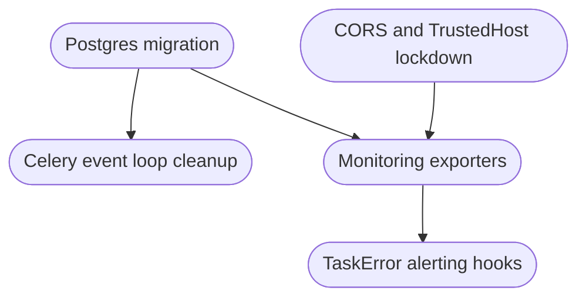

# Phase 2 Infrastructure Hardening & Observability Breakdown

## Summary of objectives and deliverables
- Replace the single-node SQLite bottleneck with a Docker Compose friendly Postgres service and updated runtime configuration so multiple workers can read/write concurrently, aligning with [`plans/PHASED_CODEBASE_PLAN.md:31`](plans/PHASED_CODEBASE_PLAN.md:31).
- Enforce least-privilege networking by tightening CORS and TrustedHost policies sourced from environment variables defined in `.env` artifacts (`.env.example`, `frontend/.env.example`). The FastAPI application should load these through [`app/main.py`](app/main.py:117) without wildcard defaults as identified in [`plans/PHASED_CODEBASE_PLAN.md:32`](plans/PHASED_CODEBASE_PLAN.md:32).
- Remove Celery worker contention caused by repeated `asyncio.run` calls, stabilizing task throughput described in [`plans/PHASED_CODEBASE_PLAN.md:33`](plans/PHASED_CODEBASE_PLAN.md:33).
- Expand structured logging and Prometheus/OpenTelemetry exporters so the monitoring layer (`monitoring_service`, `logging_config`) feeds actionable metrics, per [`plans/PHASED_CODEBASE_PLAN.md:34`](plans/PHASED_CODEBASE_PLAN.md:34).
- Add alerting/notification hooks to the TaskError handler so critical failures surface outside the database log, as outlined in [`plans/PHASED_CODEBASE_PLAN.md:35`](plans/PHASED_CODEBASE_PLAN.md:35).

## Cross-workstream dependency map

## Workstream breakdowns

### 1. Postgres migration & Docker Compose parity
**Source scope:** [`plans/PHASED_CODEBASE_PLAN.md:31`](plans/PHASED_CODEBASE_PLAN.md:31)

#### Actionable tasks
1. Define target Postgres images, volumes, and healthchecks inside [`docker-compose.yml`](docker-compose.yml:36) ensuring local parity with CI (depends on selecting Postgres version and storage class).
2. Update infrastructure configs (`docker-compose.override.yml` if present, `docs/DEPLOYMENT_LOCAL.md`, `.env.example`, `frontend/.env.example`) with new `DATABASE_URL`, credentials, and migration flags (blocked by task 1).
3. Refactor [`app/core/config.py`](app/core/config.py:17) to consume the updated env vars, including fallback logic for dev/test while keeping backward compatibility until SQLite removal is verified (depends on task 2).
4. Update Alembic configuration [`alembic.ini`](alembic.ini:1) and [`alembic/env.py`](alembic/env.py:1) to point at Postgres DSNs and run smoke migrations inside Compose (depends on task 3).
5. Execute data migration scripts or export/import from SQLite to Postgres, documenting rollback steps under [`docs/DEPLOYMENT_BACKUP_RECOVERY.md`](docs/DEPLOYMENT_BACKUP_RECOVERY.md:1) (depends on task 4 and Celery read/write freeze window).
6. Adjust CI to spin Postgres services (GitHub Actions service containers or docker-compose) ensuring test suites run identically to local Compose (depends on task 1 completion and validated migrations).

#### Dependencies
- Task 5 requires coordination with Celery refactor to pause workers while data is moved.
- Monitoring expansion (Workstream 4) expects Postgres metrics exporters, so Workstream 1 must expose credentials/ports for scraping.

#### Acceptance criteria
- Docker Compose `up` brings Postgres online with readiness probes and persistent volume mounts.
- All FastAPI endpoints, Celery tasks, and Alembic migrations operate against Postgres without regressions; SQLite fallback removed from `.env.example`.
- Deployment/local docs reflect connection strings and backup steps; test pipelines prove parity by running on Postgres containers.

#### Risks & mitigations
- **Data loss during migration:** mitigate via pre-flight snapshots and dry-run migration in a staging Compose project.
- **Library incompatibilities:** verify `psycopg`/async drivers in [`pyproject.toml`](pyproject.toml:1) before switch.

#### Documentation updates
- `.env.example`, `frontend/.env.example`
- [`docs/DEPLOYMENT_LOCAL.md`](docs/DEPLOYMENT_LOCAL.md:1), [`docs/DEPLOYMENT_BACKUP_RECOVERY.md`](docs/DEPLOYMENT_BACKUP_RECOVERY.md:1), [`README.md`](README.md:1)

### 2. CORS & TrustedHost lockdown
**Source scope:** [`plans/PHASED_CODEBASE_PLAN.md:32`](plans/PHASED_CODEBASE_PLAN.md:32)

#### Actionable tasks
1. Inventory required origins per environment (local, staging, prod) and encode them into env vars (`ALLOWED_ORIGINS`, `TRUSTED_HOSTS`) documented in `.env.example`.
2. Update FastAPI middleware configuration inside [`app/main.py`](app/main.py:117) to load comma-delimited origins and fail closed when unset (depends on task 1).
3. Ensure frontend bundles (`frontend/vite.config.ts`, deployment nginx) reference the same origin list to avoid mismatches (depends on task 2 and Workstream 1 env changes).
4. Add regression tests (unit/integration) verifying blocked origins receive 403 responses and TrustedHost rejects spoofed Host headers (depends on task 2).

#### Dependencies
- Postgres migration (Workstream 1) influences env templates, so coordinate updates to `.env` docs.
- Monitoring exporters (Workstream 4) might expose new endpoints; ensure CORS rules permit Prometheus scraping only from trusted networks.

#### Acceptance criteria
- Default configuration denies wildcard origins; enabling new hosts occurs exclusively through env vars.
- Automated tests demonstrate correct allow/deny behavior for both CORS and TrustedHost middleware.

#### Risks & mitigations
- **Accidental lockout of internal tools:** stage configuration via feature flag (e.g., `ALLOW_DEVTOOLS_ORIGINS`) before production rollout.

#### Documentation updates
- `.env.example`, [`docs/DEPLOYMENT_SECURITY.md`](docs/DEPLOYMENT_SECURITY.md:1), [`docs/CONFIGURATION_GUIDE.md`](docs/CONFIGURATION_GUIDE.md:1)

### 3. Celery task event-loop refactor
**Source scope:** [`plans/PHASED_CODEBASE_PLAN.md:33`](plans/PHASED_CODEBASE_PLAN.md:33)

#### Actionable tasks
1. Audit [`app/tasks.py`](app/tasks.py:132) and [`app/tasks/celery_app.py`](app/tasks/celery_app.py:1) to inventory async call sites invoking `asyncio.run`.
2. Introduce shared event loop helpers or synchronous wrappers (e.g., `async_to_sync`) reused by Celery workers to prevent per-task loop creation (depends on task 1).
3. Update task implementations within `app/application/*` services to use the new helpers; ensure DB session scoping matches Postgres transaction rules (depends on Workstream 1 completion for DSN stability).
4. Expand Celery beat/worker configuration (`app/tasks/celery_beat.py`, Docker Compose worker service) to pass tuning options (prefetch, concurrency) validated during load tests (depends on task 3).
5. Run load tests (can leverage `docs/ENDPOINTS_TASKS.md` scenarios) to confirm no event-loop contention and capture metrics for Workstream 4 (depends on monitoring instrumentation availability).

#### Dependencies
- Requires Postgres stability for DB sessions and Monitoring exporters to observe worker metrics.

#### Acceptance criteria
- Celery workers do not spawn per-task event loops and sustain target throughput under synthetic load.
- No deadlocks or DB session leaks occur during concurrent tasks; logs confirm single loop reuse.

#### Risks & mitigations
- **Hidden async dependencies:** add linting rule or CI check to block future `asyncio.run` usage in task modules.

#### Documentation updates
- [`docs/ENDPOINTS_TASKS.md`](docs/ENDPOINTS_TASKS.md:1), [`docs/MONITORING.md`](docs/MONITORING.md:1) for new worker metrics.

### 4. Monitoring exporters & structured logging
**Source scope:** [`plans/PHASED_CODEBASE_PLAN.md:34`](plans/PHASED_CODEBASE_PLAN.md:34)

#### Actionable tasks
1. Define target metrics/logging stack (Prometheus scrape endpoints, OpenTelemetry exporters) and required labels; capture in `docs/MONITORING.md`.
2. Enhance [`app/infrastructure/monitoring/monitoring_service.py`](app/infrastructure/monitoring/monitoring_service.py:1) to emit Prometheus metrics (HTTP, Celery, DB) with aggregation-friendly naming (depends on task 1 and Postgres DSN visibility from Workstream 1).
3. Update [`app/core/logging_config.py`](app/core/logging_config.py:1) to include structured log formatters and log shipping hooks (e.g., to stdout JSON) and ensure Celery workers inherit the config (depends on task 2).
4. Wire Docker Compose services (API, workers) with `metrics` ports and optional sidecar exporters; document how to enable them locally (depends on tasks 2-3).
5. Validate metrics in local Compose via existing monitoring stack (Grafana dashboards in [`docs/GRAFANA_DASHBOARDS.md`](docs/GRAFANA_DASHBOARDS.md:1)) and capture screenshots for documentation (depends on task 4).

#### Dependencies
- Needs Postgres service credentials for DB metrics, Celery refactor for accurate worker telemetry, and CORS lockdown to expose metrics endpoints only to trusted hosts.

#### Acceptance criteria
- Prometheus/OpenTelemetry endpoints expose API, DB, and Celery metrics accessible from Docker Compose network.
- Structured logs include trace IDs/correlation IDs and feed the same format from FastAPI and Celery containers.

#### Risks & mitigations
- **Metric cardinality explosion:** enforce label whitelists and sampling before rollout.

#### Documentation updates
- [`docs/MONITORING.md`](docs/MONITORING.md:1), [`docs/GRAFANA_DASHBOARDS.md`](docs/GRAFANA_DASHBOARDS.md:1), `.env.example` (metrics ports/toggles).

### 5. TaskError alerting hooks
**Source scope:** [`plans/PHASED_CODEBASE_PLAN.md:35`](plans/PHASED_CODEBASE_PLAN.md:35)

#### Actionable tasks
1. Determine notification channels (webhook, email, PagerDuty) and capture secrets/config settings in `.env.example` with optional local stubs.
2. Extend [`app/infrastructure/monitoring/error_handler.py`](app/infrastructure/monitoring/error_handler.py:90) to dispatch alerts via the chosen channels, reusing structured payloads from Workstream 4 logging improvements (depends on Workstream 4 tasks 2-3).
3. Add retry/backoff logic and failure auditing so alert delivery issues surface in metrics (depends on monitoring exporters being live).
4. Write integration tests or sandbox scripts proving alerts trigger on synthetic TaskError entries and documenting escalation paths (depends on task 2).

#### Dependencies
- Relies on Workstream 4 structured logging for consistent payloads and may depend on Postgres migration for error metadata schema changes.

#### Acceptance criteria
- Critical TaskError records trigger outbound notifications with relevant context (task name, payload hash, stack trace link).
- Alert failures are visible in metrics/logs; no duplication occurs for the same error instance.

#### Risks & mitigations
- **Notification spam:** implement severity thresholds and deduplication caches before production rollout.

#### Documentation updates
- [`docs/ALERTING.md`](docs/ALERTING.md:1), `.env.example`, [`docs/CONFIGURATION_GUIDE.md`](docs/CONFIGURATION_GUIDE.md:1).

## Overall acceptance criteria recap
- Celery load tests pass without event-loop contention using the Postgres backend.
- Security review signs off on the new CORS/TrustedHost policies.
- Metrics dashboards and alerting hooks demonstrate end-to-end visibility inside Docker Compose before promoting to higher environments.

## Next steps for review
- Validate sequencing aligns with upcoming releases and confirm stakeholders for each workstream before implementation.
- Once approved, translate actionable tasks into tickets grouped by workstream dependencies shown above.
